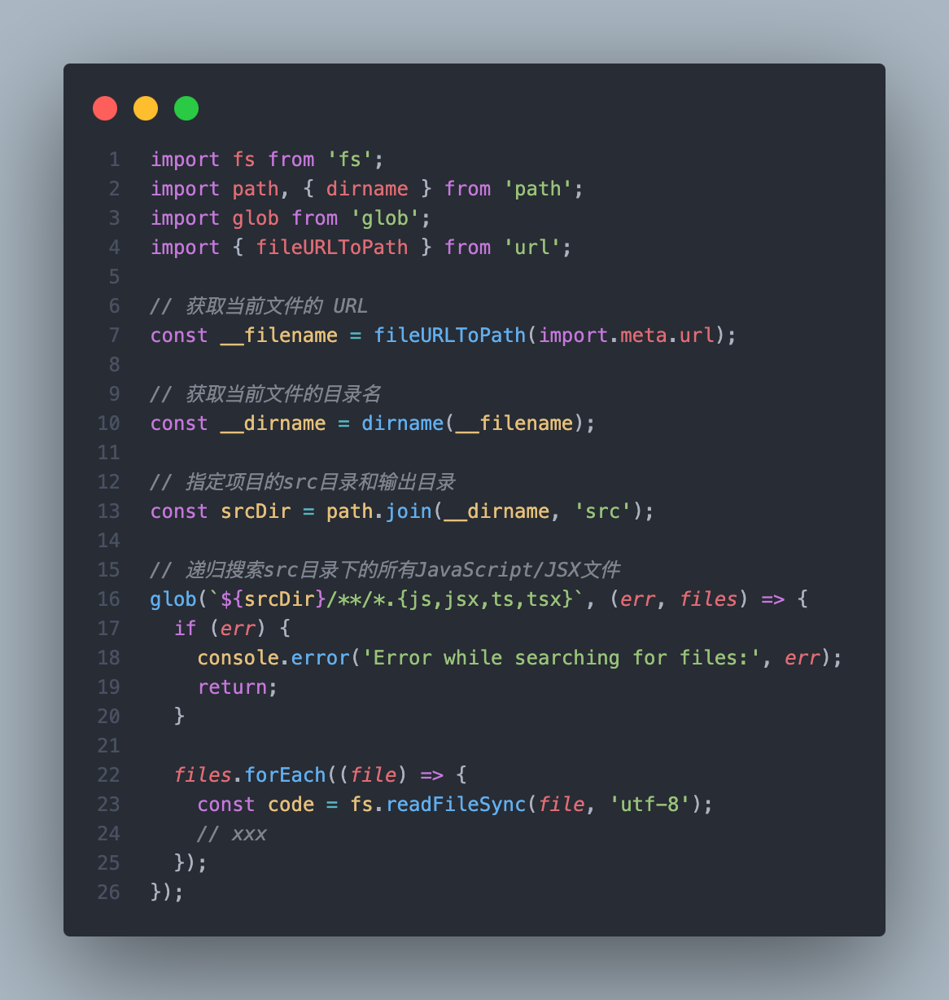
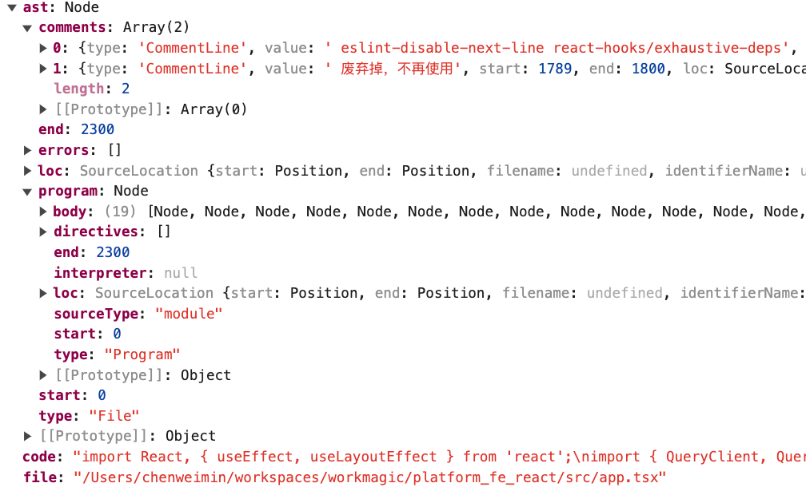
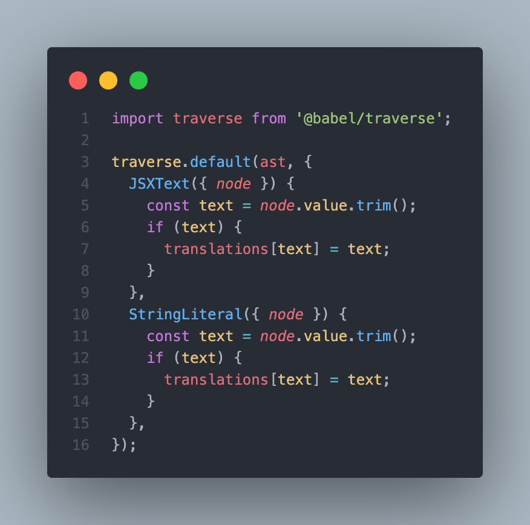
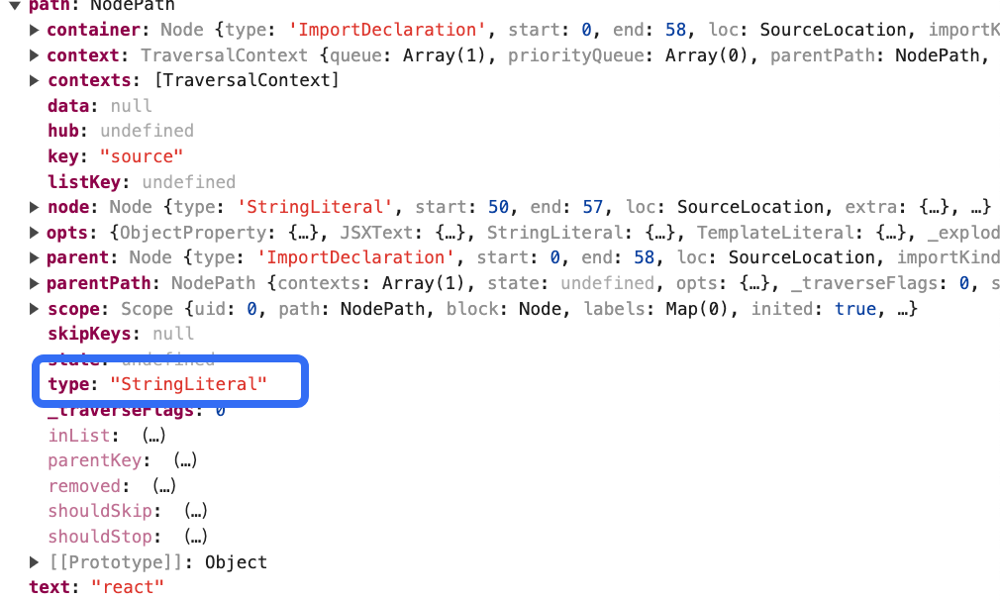
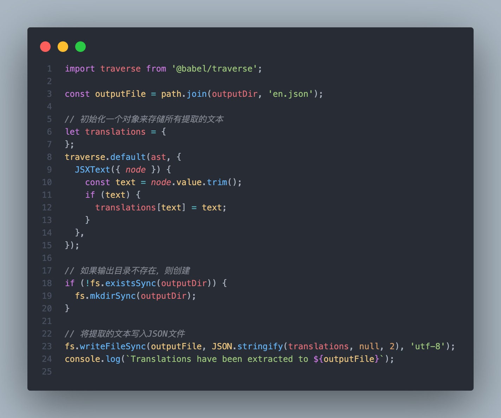
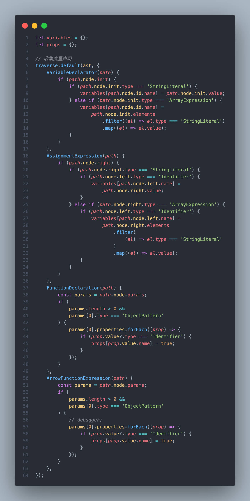
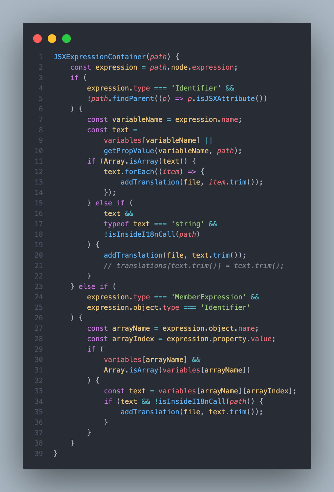

---

## 当前背景

做了几年的前端开发，没有做过什么分享与记录。想了想，做一些分享以及工作记录还是很有必要的，最近公司项目在做国际化i18n，所以想分享一下我的一些解决方案的落地，希望对大家也有一点帮助。我们是React的技术框架，项目已经在线上跑了一段时间了，在接到做多语言的需求时，开发同学是用了主流i18n库：i18next-react，在实施的过程中，我们需要对项目中现有的文本做i18n处理，对每串文本转化为`i18n.t('xxx')`，时间成本比较高，挨个的检查所有文件，非常枯燥，且无法保证不会遗漏。作为一个程序猿，其实是非常讨厌这样枯燥无味的工作内容的，我们还是喜欢做一些富有创造力的事情。如此无聊的工作让我脑子里折腾出了一个想法：我们是否能通过脚本，让机器帮我们检索所有文本内容，打印出来，同时标注其文件位置，这样可以大量减少检查的时间成本且不会出现遗漏的风险。虽然工作内容简单枯燥，那就发挥创造力，让枯燥的工作变得有趣且好玩吧 （是的，猿弟年纪越大，越喜欢折腾）。

## 递归地搜索指定目录下的所有JavaScript/JSX文件

首先第一步，我们需要指定哪些文件需要被处理，通过node的`fs.readFileSync`可以读取文件内容，但是不可能需要我们手动一个一个的对文件进行readFileSync，我们使用glob模块递归地搜索指定目录下的所有JavaScript/JSX文件



拿到每个文件的代码，我们还需要去解读这些代码，哪些才是我们要解析的文本呢？人类可以正常地解读这些代码，但是要怎么让机器去解读呢？转AST，我们可以使用`@babel/parser`来做这个事情

```ts
// src/consts.ts
import parser from '@babel/parser';

const code = fs.readFileSync(file, 'utf-8');
const ast = parser.parse(code, {
  sourceType: 'module',
  plugins: ['jsx', 'typescript']
});
```

[@babel/parser](https://babeljs.io/docs/babel-parser)是Babel中使用的 JavaScript 解析器，目前是将`code`转成机器能解读的抽象语法树AST，这里有几个参数，简单解释如下：

1、sourceType 参数用于指定代码的类型，即代码是模块（module）、脚本（script）还是unambiguous。unambiguous我也不太清楚，这个参数有两个可能的值：

- "module"：表示代码是一个 ECMAScript 模块（ESM）。使用这种模式，代码可以包含 import 和 export 语句，符合模块化规范。
- "script"：表示代码是一个普通的脚本，不使用模块化特性。在这种模式下，代码不能包含 import 和 export 语句。

2、plugins：包含您想要启用的插件。由于项目中用的是TSX，所以使用了`['jsx', 'typescript']`

拿到AST后，下面要做的事情就是我们解析里面的内容

## 遍历AST，提取文本内容
[@babel/parser](https://babeljs.io/docs/babel-parser)的官网解释，翻译成中文是：维护整体树的状态，并负责替换、删除和添加节点。

那么我们需要遍历AST做什么呢？我们可以看下AST是长什么样的：



它是一个嵌套的树结构，下面我们用[@babel/traverse](https://babeljs.io/docs/babel-traverse)来遍历它：



`traverse`第二个参数是一个对象，它的key代表着AST的节点类型，如StringLiteral，我们debbuger看下：



Babel 解析器根据Babel AST 格式生成 AST 。它基于ESTree 规范，但是他会有一些偏差，如文字标记，在ESTree 规范中，他被替换为：`StringLiteral`、`NumericLiteral`、`BigIntLiteral`、`BooleanLiteral`、`NullLiteral`、`RegExpLiteral`。我们可以看到Babel AST 格式的颗粒度会更细，有助于我们更合理的解析代码。

我们对 Babel AST 有了初步了解，接下来就是要解析jsx文件，我们可以看到上面有写到一个JSXText类型，这个是在ESTree 规范中没有的，这就要追溯到对代码转AST时用到的插件，我们用了`Typescript`和`Jsx`，他们能帮助我们解析tsx和jsx文件，JSX 代码的 AST 基于Facebook JSX AST，扩展了 ECMAScript ESTree AST 格式，从官方文档上能看到有一个`JSXText`节点类型，这个就是我们下面要处理的关键点，解析jsx，拿到所有的文本节点，然后将所有的文本信息存储为json输出



这样我们就能拿到相关的静态文本数据啦，可是这样的数据并不完整。要考虑到所有场景，比如在一个很普遍的场景，我们使用React标签语言时，是没有办法通过JSXText拿到在该节点上面的文本内容，这时候我们就要详细的根据其上下文进行分析了。

在实际的场景下，我们有很多动态内容以及很多自定义组件，处理动态内容和自定义组件中的文本可能需要更复杂的解析和提取逻辑。我们需要考虑哪些文本数据是真实需要做i18n的，同时也不能胡来，某个组件的key值可能是一个字符串，这种不值得翻译的文本就没有提取价值。这里的关键点在于要考虑哪些文本数据，是值得提取的，因为我们主要是想提取需要翻译的文本，所以我思考了一个点，做i18n的目的就是让不同语种的人能流畅的阅读页面，所以挂在DOM节点上、能通过浏览器渲染出来的文本，就是我们的目标数据。，拿到上下文数据。也就是说，我们仅需要关注JSX元素中的数据，除了JSXText，JSX上还有动态的表达式`JSXExpressionContainer`类型，只要它的上下文跟`JSXExpressionContainer`类型有关联，那么就可以认定这是值得关注的数据，但是也没办法确定`JSXExpressionContainer`一定是有用的，还有一种情况，那就是这个表达式是针对DOM属性的，一般正常的属性数据只是对节点的特性声明，没有翻译的必要，而对于一些特殊的属性，如title这些，是需要翻译的，我们可以添加到白名单上，命中白名单的数据添加额外的关注。

对于在`JSXExpressionContainer`动态表达式中，我考虑存在的情况，分别是声明的变量、prop值、字符串、模版字符串以及函数，我们首先考虑处理变量和prop的情况：

### 思路

- 遍历`VariableDeclarator`、`AssignmentExpression`、`FunctionDeclarator`和`ArrorFunctionExpression`，记录所有变量和props的值
- 遍历JSXExpressionContainer，处理表达式容器：如果表达式容器中的值是一个变量或者props，且非Attribute，结合上面记录的数据，根据之前尝试解析这个变量的值。
- 记录所有显示的文本：无论是直接文本还是通过变量插入的文本。

在尝试解析这个变量的值之前，我们要先收集所有变量，包括传递的props，所以我们要先遍历一遍：



然后再遍历`JSXExpressionContainer`节点，其中`JSXExpressionContainer`：




这里有一个`isInsideI18nCall`的判断，我们的目的是提取未翻译文本，所以要考虑剔除已经做过i18n处理的数据，`isInsideI18nCall`函数就是做了这个事情。

```typescript
const isInsideI18nCall = (path) => {
   // 我们将被i18n函数（t/i18n/translate）处理过的value，所以这里会忽略掉
    export const ignoreFns = ['t', 'i18n', 'translate'];
    while (path) {
        if (
            path.type === 'CallExpression' &&
            path.callee?.type === 'Identifier' &&
            ignoreFns.includes(path.callee?.name)
        ) {
            return true;
        }
        path = path.parentPath;
    }
    return false;
};
```

整体的逻辑基本梳理清晰了，目前遍历了JSXText和JSXExpressionContainer，还有很多细节没有处理，如JSXExpressionContainer下的StringLiteral（字符串）、TemplateLiteral（模板字符串）以及CallExpression（函数表达式）节点，我们可以通过遍历这些节点类型，判断相关上下文，在StringLiteral和TemplateLiteral中，需要判断是否在JSXExpressionContainer中（parentPath.isJSXExpressionContainer()），然后判断是否为Attribute（findParent((p) => p.isJSXAttribute())）,对于CallExpression，可能是一个React中的Rendering Lists（列表渲染），这个list可能是一个字符串形成的数组，也有可能是一个对象数组，坏了！事情仿佛又复杂了起来。如果是对象数组，需要先收集数组信息，再根据上下文与对象的prop做命中检测。

根据上面的解析逻辑，我写了一个文本解析工具，项目地址：[@i18n-extractor-cli](https://github.com/williamChen26/i18n-extractor-cli) ，基本能够解析大部分文本内容，当然还有很多细节需要完善，感兴趣的同学可以参考一下，如果有想法或者有问题，欢迎来issue！

后面的想法是实现一个eslint插件，通过lint的方式帮助有i18n需求的项目进行i18n修正，帮助开发者在开发阶段保证i18n质量。
